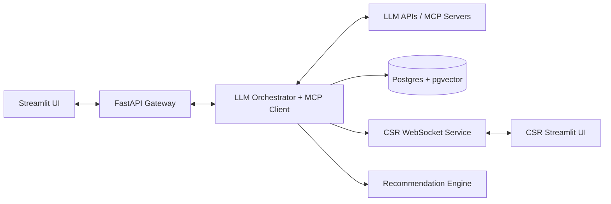
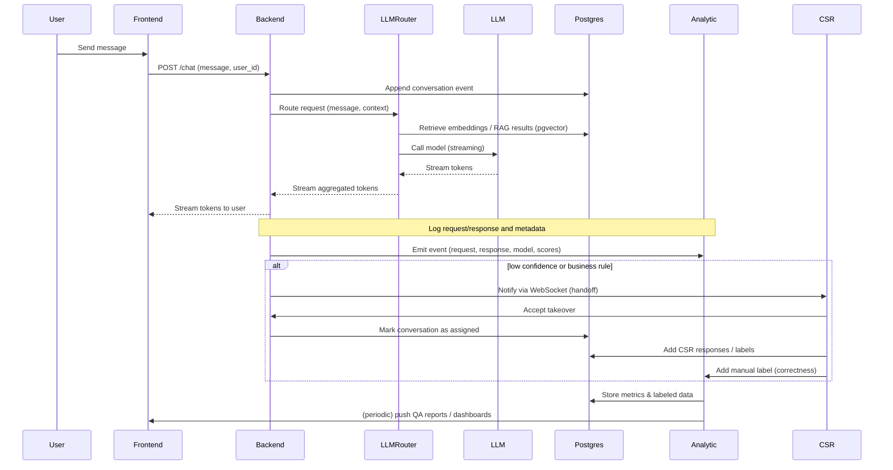
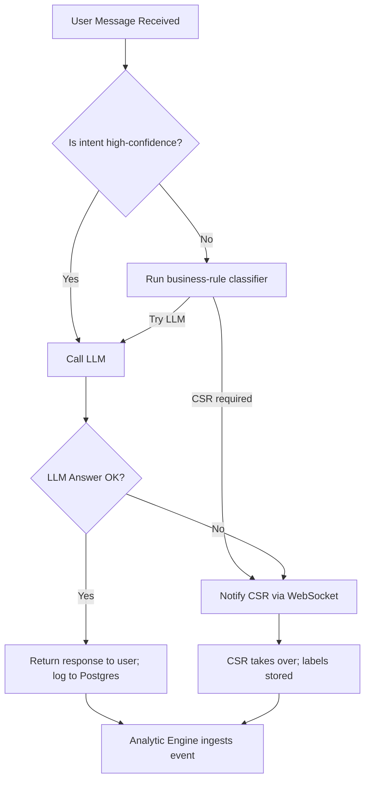
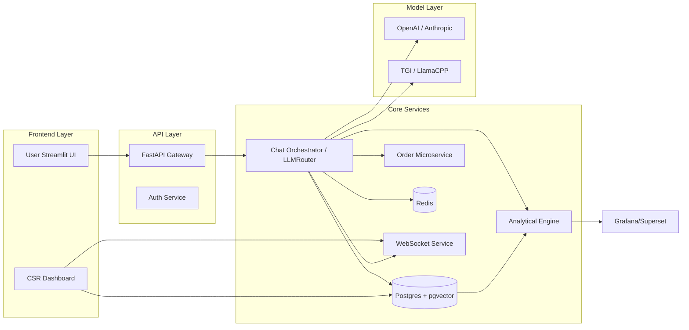

# IISc-CapstoneProject-Repo

Project 17: Customer Service and Conversational AI

Here’s the updated architecture with simpler CSR handoff and Postgres for vector storage:

**Technologies:**

- **Frontend:** Streamlit (chat UI, CSR dashboard)
- **Backend API Gateway:** FastAPI (routes requests to LLM services, MCP servers, and CSR backend)
- **LLM Orchestration:** LangChain / LlamaIndex for multi-LLM routing and integration with MCP servers
- **Vector Store:** Postgres + pgvector extension (for order details, embeddings, semantic search)
- **Business Logic Layer:** Python service for request classification, routing rules (based on business size, metrics)
- **CSR Handoff Service:** Direct WebSocket/REST communication between backend and CSR UI (no Kafka; uses Redis pub/sub or direct WebSocket)
- **Session Store:** Postgres for chat history persistence
- **Authentication:** Keycloak / Auth0
- **Recommendation Engine:** Python + embeddings in pgvector to assist CSR with suggestions
- **Monitoring/Logging:** Prometheus + Grafana; ELK stack for logs

**Flow:**

1. **Client → Streamlit UI:** User query captured.
2. **Streamlit → FastAPI API Gateway:** Query sent to backend.
3. **Classification:** Business logic service decides LLM route or CSR handoff.
4. **LLM Route:** Orchestrator calls the right LLM (OpenAI, local, etc.) and/or MCP servers for data (order details, etc.).
5. **CSR Handoff:** If needed, backend sends handoff event via WebSocket to CSR dashboard; chat history and recommendations pulled from Postgres.
6. **CSR Responds:** CSR continues conversation in real time.
7. **Persistence:** All chats stored in Postgres (with embeddings in pgvector for retrieval).

**High-Level Architecture Diagram:**

---

# 9. Analytical Engine — Metrics, Design, and Integration

## Purpose

Add an **Analytical Engine** to continuously measure, evaluate, and visualize the performance of LLMs, retrieval (RAG), and the human handoff flow. This component collects labeled data, computes evaluation metrics, detects regressions, and provides dashboards and alerts to SRE/ML teams and product owners.

## Key responsibilities

- Ingest raw chat events, LLM responses, RAG retrieval results, and CSR actions.
- Store labeled ground-truth data (manual labels from CSR or QA team) and predicted outputs for evaluation.
- Compute metrics (batch and streaming) and produce time-series and sliceable dashboards.
- Run periodic model-evaluation jobs (A/B comparisons, champion/challenger) and generate reports.
- Trigger alerts on metric drifts, degradation of model accuracy, increased hallucination, or SLA breaches.
- Provide a feedback loop: feed labeled examples back to retraining pipelines or prompt-improvement tasks.

## Core metrics to track

- **Intent classification accuracy** (and confusion matrix)
- **Response correctness / Accuracy** (manual label vs model answer)
- **Precision\@k** for RAG retrieval (are top-k hits relevant?)
- **F1 / Precision / Recall** for intent/NER/classification tasks
- **Hallucination rate** (percentage of responses with factual errors as judged by CSR/QA)
- **Escalation rate** (percentage of chats routed to CSR after initial LLM attempt)
- **Time-to-resolution** (AI-only vs AI+CSR)
- **CSR takeover time** (time between handoff decision and CSR acceptance)
- **Customer Satisfaction (CSAT)** and NPS (if available)
- **Latency / p95 / p99** (end-to-end: user->first token and full response)
- **Throughput** (requests/sec) and token usage/cost per session
- **Model agreement / ensemble variance** (when using multiple LLMs)

## Data sources

- Conversation Store (Postgres): canonical chat history and metadata.
- LLM Router logs: token streams, probability/confidence scores (if available), model metadata.
- pgvector retrieval logs: embeddings, similarity scores, top-k results.
- CSR actions/audit logs: manual labels, corrections, tags.
- Frontend telemetry: latency, network errors, UI events.

## Components of the Analytical Engine

- **Ingest & Stream Processor:** lightweight collector (Fluentd/Vector/Logstash) → Stream processor (Kafka Streams or AWS Kinesis / or plain DB-based batch jobs if you prefer simplicity). *Note:* Even if we avoid Kafka for CSR handoff, Kafka (or a managed alternative) is still useful for analytic pipelines — however if you prefer simpler stack, use a periodic batch exporter from Postgres to the analytics worker.\*
- **Feature Store / Metrics DB:** TimescaleDB or Prometheus + long-term store for metrics; Postgres for aggregated metrics and labels.
- **Evaluation Worker:** Python jobs (Airflow / Prefect) that run scheduled evaluation tasks, generate reports, and compute metrics.
- **Labeling UI:** CSR dashboard includes a quick "label this reply" button to capture ground-truth; or a separate QA tool (Label Studio / Prodigy) for bulk labeling.
- **Dashboarding & Alerts:** Grafana for time-series metrics and dashboards; Superset for table-based reports; Alertmanager for threshold alerts.

## Feedback loop

1. CSR labels / QA labels are persisted to Postgres (labels table) and linked to conversation IDs.
2. Evaluation Worker re-runs metrics jobs daily / hourly, computes deltas, and stores results in Metrics DB.
3. If metrics cross defined thresholds, Alertmanager raises tickets (Slack, PagerDuty) and notifies ML team.
4. Labeled examples are exported to training dataset buckets (S3) for retraining.

---

# 10. Sequence Diagram (Mermaid)

---

# 11. Decision Flowchart (Mermaid)

---

# 12. System Design Diagram (Mermaid component view)

---

# 13. Implementation notes & next steps

- Add lightweight event export from Postgres to the Analytic Engine (logical replication or periodic batch export) to keep the stack simple.
- Ensure labeling ergonomics for CSRs: 1-click correctness labels, multi-choice tags (hallucination, partial, wrong entity), and optional free-text corrections.
- Start with daily batch evaluations and once stable add near-real-time streaming metrics.
- Define SLOs and alert thresholds (e.g., hallucination rate > 2% triggers review).

---

If you'd like, I can:

- Append the new sections into the Word proposal and regenerate the `.docx` with these changes included, or
- Export the Mermaid diagrams as PNGs/SVGs and attach them, or
- Produce a runnable analytics starter (Postgres export jobs + Python evaluation workers + Grafana dashboard templates).

Which would you like next?
