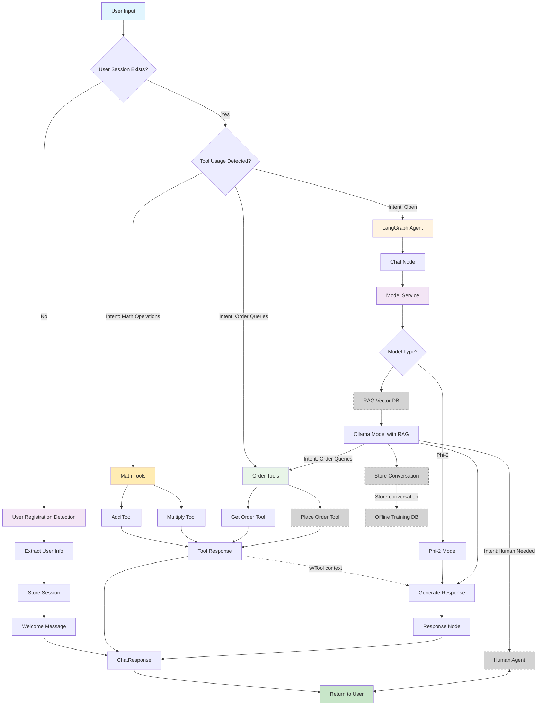
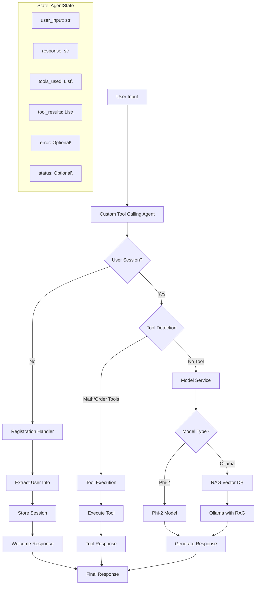

# Complete CCCP Advanced Chat Flow

## Current Architecture Overview



## Detailed Flow Description

### 1. **Input Processing**
- User sends chat request via Streamlit UI
- Request contains: `prompt`, `user_id`, optional `session_id`

### 2. **User Registration Detection** (First Check)
- **Pattern Matching**: Detects user registration information
  - `My user ID is X` → Extract user ID
  - `I'm John Smith` → Extract name
  - `My mobile is 1234567890` → Extract mobile
- **Session Storage**: Stores user information for personalization
- **Welcome Message**: Generates personalized welcome response

### 3. **Tool Usage Detection** (Second Check)
- **Math Operations**: 
  - `multiply X and Y` → Multiply tool
  - `add X and Y` → Add tool
- **Order Queries**:
  - `cart status`, `my order`, `tracking details` → Get Order tool
  - Keywords: `cart`, `order`, `shipment`, `delivery`, `tracking`
- **Tool Execution**: If tool detected, executes appropriate tool directly
- **Response**: Returns structured `ChatResponse` with tool metadata

### 4. **General Chat Processing** (LangGraph Agent - Fallback)
- **Entry Point**: `chat` node
- **Model Service**: Determines which model to use (Ollama vs Phi-2)
- **Model Selection**:
  - **Ollama with RAG**: If running, queries RAG store then uses `llama3.2:latest`
  - **Phi-2**: Fallback to `microsoft/phi-2` (no RAG)
- **RAG Store Query**: Retrieves relevant context for Ollama model
- **Response Generation**: Model generates response with retrieved context
- **Response Node**: Formats and adds metadata

### 5. **Response Formatting**
- **Metadata**: Includes execution time, model used, tools used
- **Status**: Success/error status
- **Structure**: Consistent `ChatResponse` format

## Current LangGraph Workflow



## File Structure

```
src/cccp/
├── agents/
│   ├── state.py                        # AgentState definition
│   ├── intent_classifier.py            # Intent classification logic
│   ├── custom_tool_calling_agent.py    # Custom tool calling agent
│   ├── visualize_workflow.py           # Visualization script
│   └── workflows/
│       └── nodes/
│           ├── chat_agent.py           # Main chat workflow
│           ├── chat_node.py            # Chat processing node
│           ├── response_node.py        # Response formatting node
│           └── tool_node.py            # Tool execution node
├── api/
│   ├── server.py                       # FastAPI server setup
│   ├── models/
│   │   ├── requests.py                 # Request models
│   │   └── responses.py                # Response models
│   └── routes/
│       ├── chat.py                     # Main chat endpoint
│       ├── health.py                   # Health check endpoint
│       └── tools.py                    # Tools management endpoint
├── core/
│   ├── config.py                       # Configuration management
│   ├── exceptions.py                   # Custom exceptions
│   └── logging.py                      # Logging configuration
├── models/
│   ├── base.py                         # Base model interface
│   ├── phi2_model.py                   # Phi-2 implementation
│   └── ollama_model.py                 # Ollama implementation
├── services/
│   ├── chat_service.py                 # Chat service logic
│   └── model_service.py                # Model selection logic
├── tools/
│   ├── base.py                         # Base tool interface
│   ├── registry.py                     # Tool registry and discovery
│   ├── math/
│   │   ├── add.py                      # Addition tool
│   │   └── multiply.py                 # Multiplication tool
│   └── order/
│       └── get_order.py                # Order query tool
├── mcp/
│   └── client.py                       # MCP client integration
├── convstore/
│   ├── db_config.py                    # Database configuration
│   └── storecoversation.py             # Conversation storage
└── ui/
    └── streamlit_app.py                # Streamlit UI application
```

### Visual Structure (Copy to Google Slides)

```mermaid
graph TD
    A[src/cccp/] --> B[agents/]
    A --> C[api/]
    A --> D[core/]
    A --> E[models/]
    A --> F[services/]
    A --> G[tools/]
    A --> H[mcp/]
    A --> I[convstore/]
    A --> J[ui/]
    
    B --> B1[state.py]
    B --> B2[intent_classifier.py]
    B --> B3[custom_tool_calling_agent.py]
    B --> B4[visualize_workflow.py]
    B --> B5[workflows/]
    
    B5 --> B51[nodes/]
    B51 --> B511[chat_agent.py]
    B51 --> B512[chat_node.py]
    B51 --> B513[response_node.py]
    B51 --> B514[tool_node.py]
    
    C --> C1[server.py]
    C --> C2[models/]
    C --> C3[routes/]
    
    C2 --> C21[requests.py]
    C2 --> C22[responses.py]
    
    C3 --> C31[chat.py]
    C3 --> C32[health.py]
    C3 --> C33[tools.py]
    
    D --> D1[config.py]
    D --> D2[exceptions.py]
    D --> D3[logging.py]
    
    E --> E1[base.py]
    E --> E2[phi2_model.py]
    E --> E3[ollama_model.py]
    
    F --> F1[chat_service.py]
    F --> F2[model_service.py]
    
    G --> G1[base.py]
    G --> G2[registry.py]
    G --> G3[math/]
    G --> G4[order/]
    
    G3 --> G31[add.py]
    G3 --> G32[multiply.py]
    
    G4 --> G41[get_order.py]
    
    H --> H1[client.py]
    
    I --> I1[db_config.py]
    I --> I2[storecoversation.py]
    
    J --> J1[streamlit_app.py]
    
    style A fill:#e1f5fe,stroke:#01579b,stroke-width:3px
    style B fill:#f3e5f5,stroke:#4a148c,stroke-width:2px
    style C fill:#e8f5e8,stroke:#1b5e20,stroke-width:2px
    style D fill:#fff3e0,stroke:#e65100,stroke-width:2px
    style E fill:#fce4ec,stroke:#880e4f,stroke-width:2px
    style F fill:#e0f2f1,stroke:#004d40,stroke-width:2px
    style G fill:#fff8e1,stroke:#f57f17,stroke-width:2px
    style H fill:#f1f8e9,stroke:#33691e,stroke-width:2px
    style I fill:#e8eaf6,stroke:#1a237e,stroke-width:2px
    style J fill:#f9fbe7,stroke:#827717,stroke-width:2px
```



## Key Components

### **Tool System**
- **Math Tools**: `addtool`, `multiplytool`
  - Patterns: `add X and Y`, `multiply X and Y`
- **Order Tools**: `getorder`
  - Patterns: `cart status`, `my order`, `tracking details`
- **User Registration**: Built-in registration system
  - Patterns: `My user ID is X`, `I'm John Smith`, `My mobile is X`
- **Detection**: Regex-based pattern matching with keyword detection
- **Execution**: Direct tool invocation with error handling

### **Model System**
- **Abstraction**: `BaseModel` interface
- **Implementations**: `Phi2Model`, `OllamaModel`
- **Service**: `ModelService` for dynamic selection
- **Configuration**: Environment-based model switching

### **RAG System** (Retrieval-Augmented Generation)
- **RAG Store**: Vector database for storing and retrieving relevant context
- **Query Process**: Searches for relevant documents based on user input
- **Context Integration**: Injects retrieved context into Ollama model prompts
- **Fallback**: Phi-2 model operates without RAG for basic responses

### **LangGraph Integration**
- **State Management**: `AgentState` for workflow state
- **Node Structure**: Modular node-based processing
- **Workflow**: Linear flow with extensibility

## Future Enhancements

1. **Tool Integration**: Add more tools to LangGraph workflow
2. **Conditional Routing**: Route based on input type
3. **Memory Management**: Add conversation memory
4. **Error Recovery**: Better error handling and recovery
5. **Multi-step Reasoning**: Complex multi-step workflows
6. **Tool Selection**: Dynamic tool selection within workflow

## Usage

To generate visualizations:

```bash
# Activate environment
source uv3135a/bin/activate

# Run visualization
python src/cccp/agents/visualize_workflow.py
```

This will generate:
- `workflow_mermaid.md` - Mermaid diagrams
- `workflow_structure.txt` - Text-based structure


