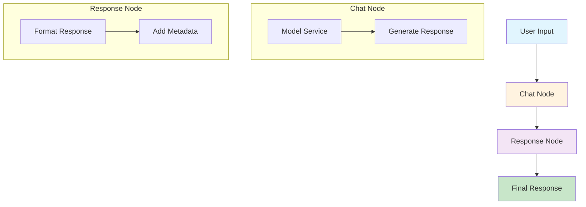

# LangGraph Chat Agent Workflow

## Workflow Description

1. **User Input**: User sends a chat request
2. **Chat Node**: 
   - Gets model instance (Ollama or Phi-2)
   - Generates response using the model
3. **Response Node**: 
   - Formats the final response
   - Adds metadata (execution time, model used, etc.)
4. **Final Response**: Returns structured response to user

## Current Flow
- **Entry Point**: `chat` node
- **Flow**: `chat` → `response`
- **State**: `AgentState` (messages, user_input, response, tools_used, error)

## Current Implementation

The workflow currently has a simple linear flow:
- **Chat Node**: Processes user input using the configured model
- **Response Node**: Formats and returns the response

## Future Enhancements

This structure can be extended to include:
- Tool selection and execution
- Conditional routing based on input type
- Memory management
- Error handling and recovery
- Multi-step reasoning
