# CCCP Advanced Chat Flow - With Catalog Tools (Updated)

## Complete System Architecture

## Updated Tool System

## Intent Classification Flow

## Catalog Tool Detection & Execution

## Order Query with Session Fallback

## Database Schema

## Supported User Queries

## Parameter Extraction Logic

## Tool Registry & Auto-Discovery

## Llama 3.2 Tool Detection Flow

## Database Query Flow (Positional Parameters)

## Response Formatting

```mermaid
graph TD
    A[Query Results] --> B{Tool Type?}
    
    B -->|ListCollections| C1[Format Collections List]
    B -->|GetCatalog| C2[Format Catalog]
    B -->|SearchProducts| C3[Format Search Results]
    B -->|GetOrder| C4[Format Order Details]
    
    C1 --> D1[🛍️ Available Collections:<br/>📦 Electronics 6 products<br/>📦 Furniture 6 products<br/>...]
    
    C2 --> D2[📋 Product Catalog<br/>📦 Books<br/>• Product Name<br/>  Price: ₹ 599.00<br/>  Stock: 120 available<br/>...]
    
    C3 --> D3[Found 2 products matching 'laptop'<br/>📋 Product Catalog<br/>• Lenovo IdeaPad...<br/>...]
    
    C4 --> D4{Search Method?}
    D4 -->|By Email| D41[Cart details for Harish<br/>Searched by email: ...<br/>Cart ID 454<br/>Total: ₹199.97]
    D4 -->|By Cart ID| D42[Cart details for Harish<br/>Cart ID 454<br/>Total: ₹199.97]
    
    D1 --> E[Return to User]
    D2 --> E
    D3 --> E
    D41 --> E
    D42 --> E
    
    style D1 fill:#fff9c4
    style D2 fill:#fff9c4
    style D3 fill:#fff9c4
    style D41 fill:#dcedc8
    style D42 fill:#dcedc8
    style E fill:#c8e6c9
```

## Complete System Overview

