# CCCP Advanced Chat Flow - Complete Shopping System (Updated Oct 2025)

## Complete System Architecture (Updated: Multi-Turn + Shopping Cart)

## Complete Tool System (11 Production Tools)

## Intent Classification Flow

## Catalog Tool Detection & Execution

## Order Query with Multi-Turn Context + Dual-Table Query (UPDATED)

## Database Schema (Updated with Shopping Cart Tables)

## Supported User Queries (Complete Shopping System)

## Parameter Extraction Logic

## Tool Registry & Auto-Discovery

## Llama 3.2 Tool Detection Flow (Enhanced: Context + Validation + Negative Examples)

```mermaid
graph TD
    A[User Input] --> A1[Load Conversation History]
    A1 --> A2[Format Last 5 Turns]
    A2 --> B[Get Available Tools Info]
    B --> C[Generate v2_llama_optimized Prompt<br/>28+ Examples + 5 Negative Samples]
    
    C --> C1[Include Conversation Context]
    C1 --> D[Llama 3.2 LLM]
    D --> E{JSON Response?}
    
    E -->|Valid JSON| F[Parse JSON]
    E -->|Empty/Invalid| G0[Extract Any LLM Params]
    
    F --> F1{Handle Flat/Nested JSON}
    F1 -->|Nested 'parameters' key| F2[Extract from params]
    F1 -->|Flat format| F3[Extract non-metadata keys]
    
    F2 --> F4{Tool + Confidence?}
    F3 --> F4
    
    F4 -->|tool_name + conf ≥ 0.7| H[Execute Tool]
    F4 -->|No tool/low confidence| G0
    
    G0 --> G[Regex Fallback + LLM Params]
    
    G --> I{Pattern Priority}
    I -->|1. Order keywords| J4[getorder]
    I -->|2. Address pattern| J6[checkout inferred]
    I -->|3. Cart keywords| J7[cart tools]
    I -->|4. Collection name| J1[getcatalog]
    I -->|5. Search keyword| J3[searchproducts]
    I -->|6. Collections list| J2[listcollections]
    I -->|7. Math pattern| J5[add/multiply]
    I -->|No match| K[General Chat]
    
    J4 --> V1{Validate LLM Params}
    V1 -->|Placeholder 'your_order_id'| V2[Discard, extract from input]
    V1 -->|Valid params| V3[Use LLM params]
    V2 --> H
    V3 --> H
    
    J1 --> V4{LLM Params Available?}
    V4 -->|Yes + valid| V5[Use LLM params]
    V4 -->|No| V6[Extract from regex]
    V5 --> H
    V6 --> H
    
    J2 --> H
    J3 --> H
    J5 --> H
    J6 --> H
    J7 --> H
    
    H --> H1{Empty Params for getorder?}
    H1 -->|Yes| H2[Inject Session Email]
    H1 -->|No| H3[Use Params]
    H2 --> L
    H3 --> L
    
    L[Tool Result] --> SAVE[Save to Conversation History<br/>Track: user input + tool used]
    K --> M[LLM Response]
    M --> SAVE
    
    SAVE --> N[Return to User]
    
    style A1 fill:#b39ddb,stroke:#4a148c,stroke-width:2px
    style C fill:#9fa8da,stroke:#3f51b5,stroke-width:2px
    style D fill:#9fa8da,stroke:#3f51b5,stroke-width:2px
    style F1 fill:#fff9c4,stroke:#f57f17,stroke-width:2px
    style G fill:#ffab91,stroke:#e64a19,stroke-width:2px
    style V1 fill:#fff9c4,stroke:#f57f17,stroke-width:2px
    style H2 fill:#aed581,stroke:#33691e,stroke-width:2px
    style SAVE fill:#b39ddb,stroke:#4a148c,stroke-width:2px
    style L fill:#c8e6c9
```

## Database Query Flow (Positional Parameters)

## Response Formatting

## Complete System Overview

## Multi-Turn Shopping Flow Example (NEW - Oct 2025)

```mermaid
sequenceDiagram
    participant U as User
    participant A as Agent + Llama 3.2
    participant S as Session (Cart + History)
    participant DB as PostgreSQL
    
    Note over U,DB: Turn 1: Browse Catalog
    U->>A: "show me Books"
    A->>A: LLM detects: getcatalog(collection_name="Books")
    A->>DB: Query g5_product WHERE collection='Books'
    DB-->>A: 6 books found
    A->>S: Save turn: getcatalog
    A-->>U: 📋 Books Catalog (6 products)
    
    Note over U,DB: Turn 2: Add to Cart
    U->>A: "Add Atomic Habits"
    A->>S: Load history (Turn 1: getcatalog Books)
    A->>A: Context: User browsing Books
    A->>A: LLM detects: addtocart("Atomic Habits", qty=1)
    A->>DB: Find product "Atomic Habits"
    DB-->>A: Product found
    A->>S: Add to cart (1 item)
    A->>S: Save turn: addtocart
    A-->>U: ✅ Added Atomic Habits (₹699)
    
    Note over U,DB: Turn 3: Continue Browsing
    U->>A: "What about Electronics?"
    A->>S: Load history (Turn 1: getcatalog, Turn 2: addtocart)
    A->>A: Context: User shopping, cart has 1 item
    A->>A: LLM detects: getcatalog("Electronics")
    A->>DB: Query Electronics collection
    DB-->>A: 6 electronics found
    A->>S: Save turn: getcatalog
    A-->>U: 📋 Electronics Catalog (6 products)
    
    Note over U,DB: Turn 4: Add More Items
    U->>A: "Add 2 Samsung Galaxy"
    A->>S: Load history (3 turns, cart exists)
    A->>A: LLM detects: addtocart("Samsung Galaxy", qty=2)
    A->>DB: Find product
    DB-->>A: Samsung found
    A->>S: Update cart (2 items, 3 units)
    A->>S: Save turn: addtocart
    A-->>U: ✅ Added Samsung × 2 (₹33,998)
    
    Note over U,DB: Turn 5: Checkout (Address Only!)
    U->>A: "123 Main St, Bangalore 560001"
    A->>S: Load history (Turns with addtocart)
    A->>A: Context: User added items recently
    A->>A: Detects: Address pattern + cart context
    A->>A: Infers: checkout!
    A->>S: Validate cart (2 items)
    A->>DB: Create order in g5_order
    A->>DB: Create items in g5_order_items
    DB-->>A: Order #1 created
    A->>S: Clear cart
    A->>S: Save turn: checkout
    A-->>U: 📦 Order Confirmation #1
    
    Note over U,DB: Turn 6: Track Order (Vague Query!)
    U->>A: "show me my order"
    A->>S: Load history (Turn 5: checkout)
    A->>A: Context: User just checked out
    A->>A: LLM detects: getorder(params={})
    A->>A: Empty params → Inject session email
    A->>DB: Query g5_order by email (Dual-table)
    DB-->>A: Order #1 found (with items)
    A->>S: Save turn: getorder
    A-->>U: 📦 Order #1 Details (2 items)
    
    rect rgb(200, 230, 201)
        Note over U,DB: ✅ Complete Multi-Turn Flow<br/>6 Turns, 5 Tools Used<br/>Natural Conversation!
    end
```

