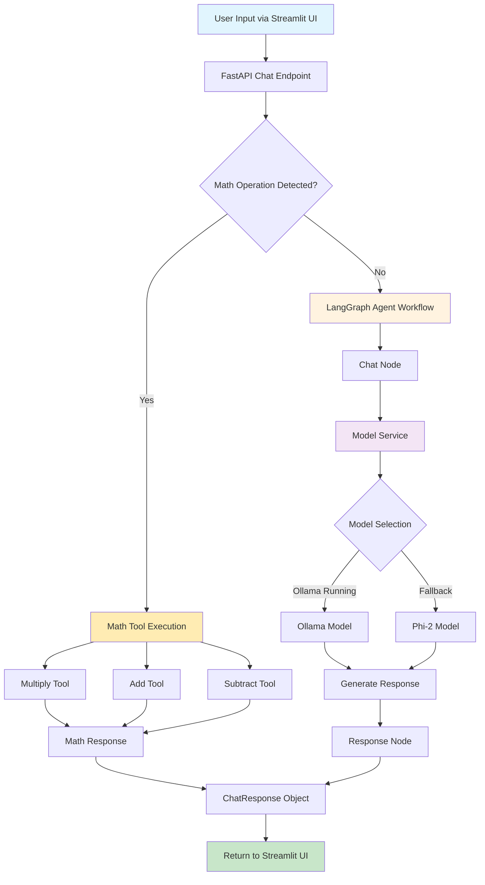
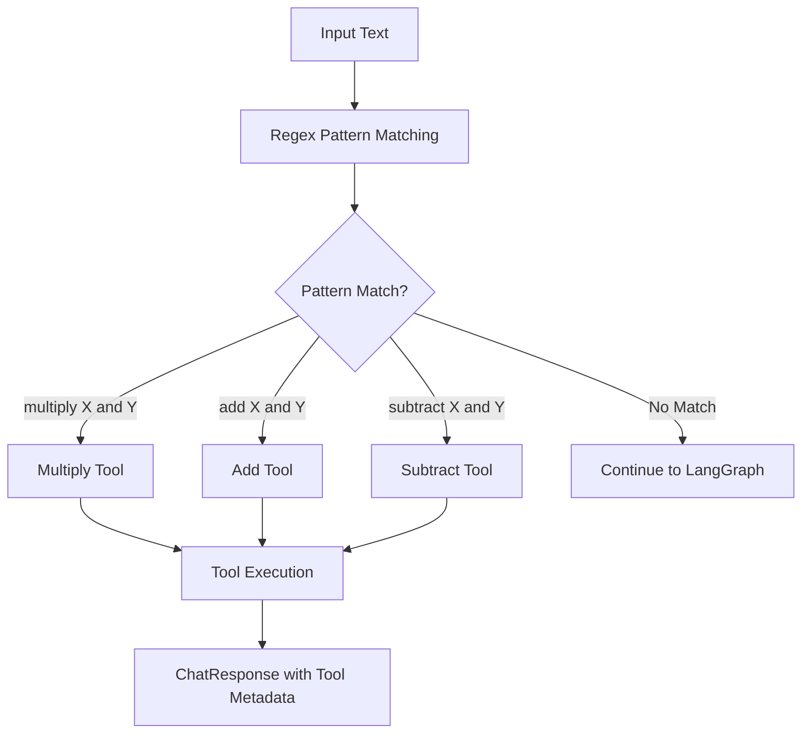
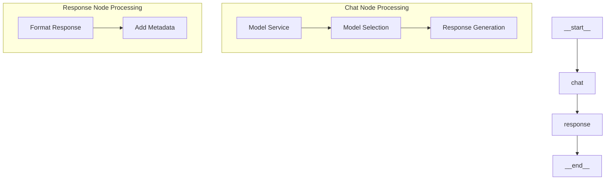
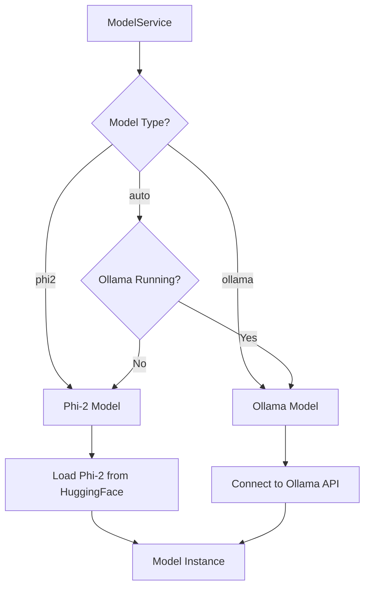

# Complete CCCP Advanced System Flow

## System Architecture Overview



## Detailed Component Flow

### 1. **Input Layer**
```mermaid
graph LR
    A[Streamlit UI] --> B[ChatRequest]
    B --> C[FastAPI /chat/generate]
    
    subgraph "Request Structure"
        D[prompt: str]
        E[user_id: str]
        F[session_id: Optional[str]]
    end
```

### 2. **Math Tool Detection & Execution**


### 3. **LangGraph Agent Workflow**


### 4. **Model Service Architecture**


## Current LangGraph Workflow Structure

### **Nodes:**
- `__start__` → Entry point
- `chat` → Main processing node
- `response` → Response formatting
- `__end__` → Exit point

### **Edges:**
- `__start__` → `chat`
- `chat` → `response` 
- `response` → `__end__`

### **State Schema (AgentState):**
```python
{
    "messages": List[BaseMessage],      # Conversation history
    "user_input": str,                  # Current user input
    "response": str,                    # Generated response
    "tools_used": List[str],           # Tools used in processing
    "error": Optional[str]             # Error information
}
```

## File Structure & Responsibilities

```
src/cccp/
├── agents/
│   ├── state.py                    # AgentState definition
│   ├── visualize_workflow.py       # Visualization utilities
│   └── workflows/
│       ├── chat_agent.py          # Main LangGraph workflow
│       └── nodes/
│           ├── chat_node.py       # Chat processing logic
│           └── response_node.py   # Response formatting
├── api/
│   ├── server.py                  # FastAPI application
│   └── routes/
│       └── chat.py               # Chat endpoint with tool detection
├── models/
│   ├── base.py                   # BaseModel interface
│   ├── phi2_model.py            # Phi-2 implementation
│   └── ollama_model.py          # Ollama implementation
├── services/
│   └── model_service.py         # Model selection & management
└── core/
    ├── config.py                # Configuration management
    └── logging.py              # Logging setup
```

## Tool System Architecture

### **Math Tools:**
- **Detection**: Regex patterns for `multiply`, `add`, `subtract`
- **Execution**: Direct tool invocation with error handling
- **Response**: Structured `ChatResponse` with tool metadata

### **Tool Functions:**
```python
@tool
def multiply(a: int, b: int) -> int:
    """Multiplies two numbers and returns the result."""
    return a * b

@tool  
def add(a: int, b: int) -> int:
    """Adds two numbers and returns the result."""
    return a + b

@tool
def subtract(a: int, b: int) -> int:
    """Subtracts two numbers and returns the result."""
    return a - b
```

## Model Integration

### **Model Abstraction:**
- **BaseModel**: Common interface for all models
- **ModelConfig**: Configuration for model parameters
- **ModelService**: Dynamic model selection and management

### **Supported Models:**
1. **Ollama** (`llama3.2:latest`)
   - Local LLM via Ollama API
   - Auto-detected if running
   - Fallback option

2. **Phi-2** (`microsoft/phi-2`)
   - Hugging Face Transformers
   - Default fallback model
   - Local inference

## Response Format

### **ChatResponse Structure:**
```python
{
    "response": str,              # Generated response text
    "status": str,               # "success" or "error"
    "user_id": str,              # User identifier
    "tool_used": Optional[str],  # Tool name if used
    "metadata": {                # Additional information
        "execution_time": float,
        "model_used": str,
        "operation": str,        # For math operations
        "result": Any           # Tool result
    }
}
```

## Configuration Management

### **Environment Variables:**
- `MODEL_TYPE`: `phi2` | `ollama` | `auto`
- `MODEL_NAME`: Model identifier
- `OLLAMA_BASE_URL`: Ollama server URL
- `MODEL_DEVICE`: Device for model execution

### **Model Switching:**
1. **Via Environment**: Update `.env` file
2. **Via Code**: Modify `config.py` defaults
3. **Runtime**: ModelService auto-detection

## Future Enhancement Opportunities

### **LangGraph Extensions:**
1. **Tool Integration**: Add tools to LangGraph workflow
2. **Conditional Routing**: Route based on input analysis
3. **Memory Management**: Conversation history persistence
4. **Error Recovery**: Robust error handling
5. **Multi-step Reasoning**: Complex workflow chains

### **Additional Tools:**
1. **Web Search**: Real-time information retrieval
2. **File Operations**: Document processing
3. **API Calls**: External service integration
4. **Database Queries**: Data retrieval and storage

### **Advanced Features:**
1. **Streaming Responses**: Real-time response generation
2. **Function Calling**: Dynamic tool selection
3. **Multi-modal**: Image and text processing
4. **Conversation Memory**: Long-term context retention

## Usage Examples

### **Math Operations:**
```
User: "add 10 and 20"
→ Tool Detection: add(10, 20)
→ Response: "The result of adding 10 and 20 is 30"
```

### **General Chat:**
```
User: "What is machine learning?"
→ LangGraph Agent: chat → response
→ Model: Generates response using Ollama/Phi-2
→ Response: Formatted answer with metadata
```

## Visualization Commands

```bash
# Generate workflow visualizations
python src/cccp/agents/visualize_workflow.py

# View generated files
cat workflow_mermaid.md
cat workflow_structure.txt
cat complete_system_flow.md
```

This comprehensive flow shows how your system integrates math tools, LangGraph agents, and multiple model backends into a cohesive chat application!
