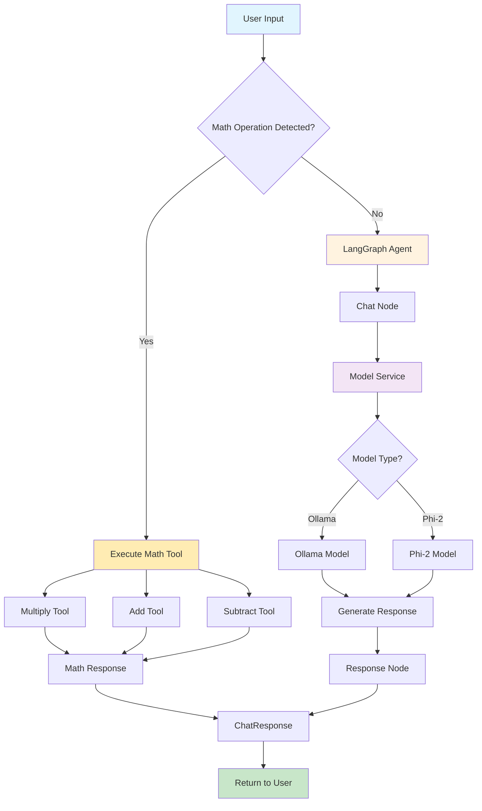

# Complete CCCP Advanced Chat Flow

## Current Architecture Overview



## Detailed Flow Description

### 1. **Input Processing**
- User sends chat request via Streamlit UI
- Request contains: `prompt`, `user_id`, optional `session_id`

### 2. **Math Operation Detection**
- **Pattern Matching**: Uses regex to detect math operations
  - `multiply X and Y` → Multiply tool
  - `add X and Y` → Add tool  
  - `subtract X and Y` → Subtract tool
- **Tool Execution**: If math detected, executes appropriate tool directly
- **Response**: Returns structured `ChatResponse` with tool metadata

### 3. **General Chat Processing** (LangGraph Agent)
- **Entry Point**: `chat` node
- **Model Service**: Determines which model to use (Ollama vs Phi-2)
- **Model Selection**:
  - **Ollama**: If running, uses `llama3.2:latest`
  - **Phi-2**: Fallback to `microsoft/phi-2`
- **Response Generation**: Model generates response
- **Response Node**: Formats and adds metadata

### 4. **Response Formatting**
- **Metadata**: Includes execution time, model used, tools used
- **Status**: Success/error status
- **Structure**: Consistent `ChatResponse` format

## Current LangGraph Workflow

```mermaid
graph LR
    A[chat] --> B[response]
    
    subgraph "State: AgentState"
        C[messages: List[BaseMessage]]
        D[user_input: str]
        E[response: str]
        F[tools_used: List[str]]
        G[error: Optional[str]]
    end
```

## File Structure

```
src/cccp/
├── agents/
│   ├── state.py                    # AgentState definition
│   ├── visualize_workflow.py       # Visualization script
│   └── workflows/
│       ├── chat_agent.py          # Main workflow
│       └── nodes/
│           ├── chat_node.py       # Chat processing
│           └── response_node.py   # Response formatting
├── api/routes/
│   └── chat.py                    # Main chat endpoint
├── models/
│   ├── phi2_model.py             # Phi-2 implementation
│   └── ollama_model.py           # Ollama implementation
└── services/
    └── model_service.py          # Model selection logic
```

## Key Components

### **Tool System**
- **Math Tools**: `multiply`, `add`, `subtract`
- **Detection**: Regex-based pattern matching
- **Execution**: Direct tool invocation with error handling

### **Model System**
- **Abstraction**: `BaseModel` interface
- **Implementations**: `Phi2Model`, `OllamaModel`
- **Service**: `ModelService` for dynamic selection
- **Configuration**: Environment-based model switching

### **LangGraph Integration**
- **State Management**: `AgentState` for workflow state
- **Node Structure**: Modular node-based processing
- **Workflow**: Linear flow with extensibility

## Future Enhancements

1. **Tool Integration**: Add more tools to LangGraph workflow
2. **Conditional Routing**: Route based on input type
3. **Memory Management**: Add conversation memory
4. **Error Recovery**: Better error handling and recovery
5. **Multi-step Reasoning**: Complex multi-step workflows
6. **Tool Selection**: Dynamic tool selection within workflow

## Usage

To generate visualizations:

```bash
# Activate environment
source uv3135a/bin/activate

# Run visualization
python src/cccp/agents/visualize_workflow.py
```

This will generate:
- `workflow_mermaid.md` - Mermaid diagrams
- `workflow_structure.txt` - Text-based structure
